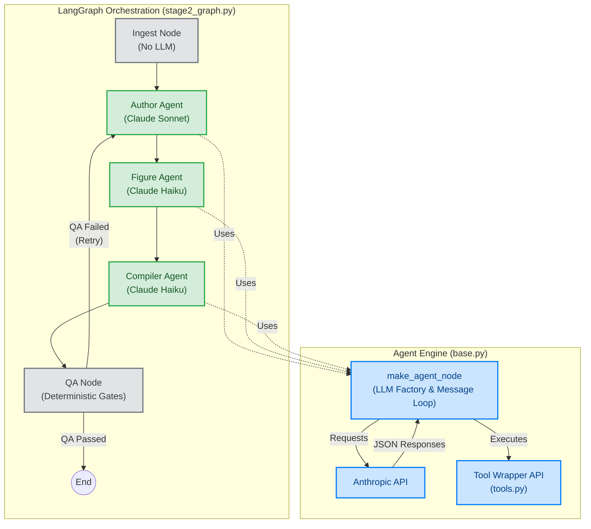

# Stage-2 Agentic Architecture Design

This document outlines the architecture for the **Stage 2 Agentic Implementation**. 
The design clearly separates non-LLM steps from LLM Agents, and shows how they are connected.

## Architectural Layers

## Layer Breakdown

### 1. LangGraph Orchestration (Stage 2 Graph)
- **Ingest & QA Nodes (Grey)**: These are completely deterministic. They do not use the LLM. Ingest prepares files, and QA runs rigorous python scripts to validate the outputs.
- **Agents (Green)**: The Author, Figure, and Compiler nodes are LLM-powered agents. 
- **The Flow**: Proceeds linearly until QA. If QA finds structural or quality failures, the flow loops back to the Author Agent to fix the errors.

### 2. Agent Engine
- **`make_agent_node` (Blue)**: Instead of copy-pasting the LLM API logic, this central factory runs the message loop for all the Agents. It talks to Anthropic and handles tool calls securely.
- **`tools.py`**: A safe wrapper around your legacy Bash/Python/Node scripts, so the Agents can only execute allowed commands.
